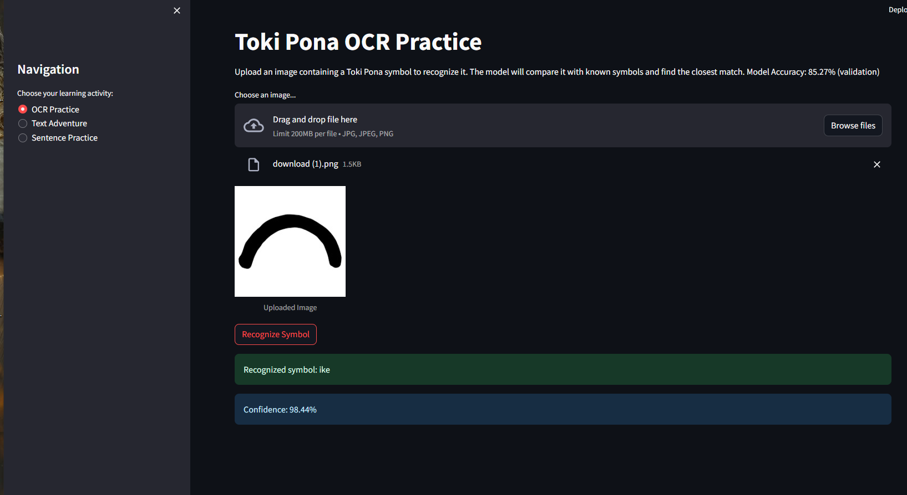
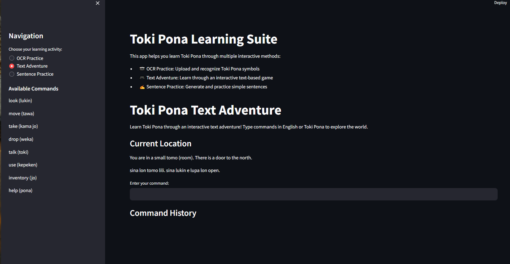

# Toki Pona Learning Platform

An interactive language learning platform for Toki Pona featuring OCR, text adventure, and sentence construction.

## 📸 Demo Screenshots

| Feature | Screenshot |
|---------|------------|
| OCR Practice |  |
| Text Adventure |  |
| Sentence Practice |  |
| Example Sentence |  |

## 🚀 Quick Start Guide

### Prerequisites
- Python 3.8 or higher
- Git
- CUDA-capable GPU (optional, for faster training)

### Installation Steps

1. **Clone the repository**
```bash
git clone https://github.com/JenMagruder/free-genai-bootcamp-2025.git
cd free-genai-bootcamp-2025/toki-pona-ocr
```

2. **Set up Python environment**
```bash
# Create and activate virtual environment
python -m venv venv
# On Windows:
venv\Scripts\activate
# On Unix/MacOS:
source venv/bin/activate

# Install dependencies
pip install -r requirements.txt
```

3. **Run the application**
```bash
streamlit run app/main.py
```

### Dependencies
All required packages are listed in `requirements.txt`:
- streamlit==1.32.0 - Web interface
- torch==2.2.0 - Deep learning framework
- torchvision==0.17.0 - Computer vision tools
- numpy==1.24.3 - Numerical computations
- Pillow==10.2.0 - Image processing
- matplotlib==3.8.2 - Plotting and visualization
- Additional utilities (see requirements.txt for full list)

### Troubleshooting Common Issues
- If you see CUDA errors, the model will fall back to CPU
- For "module not found" errors, ensure you've activated the virtual environment
- For drawing issues, try clearing browser cache or using incognito mode

## 🎯 Features

### 1. OCR Symbol Recognition (85.27% accuracy)
- Draw Toki Pona symbols directly in browser
- Get instant recognition results
- View confidence scores for predictions
- Currently supports 11 common symbols:
  - ike (bad, negative)
  - lili (small, little)
  - ma (land, earth)
  - mi (I, me, we)
  - moku (food, eat)
  - ona (he, she, it)
  - pona (good, simple)
  - sina (you)
  - suli (big, important)
  - tawa (to, for, moving)
  - tomo (house, building)

### 2. Text Adventure
- Learn through interactive storytelling
- Track vocabulary progress
- Earn points for correct choices
- Gradual difficulty progression

### 3. Sentence Constructor
- Build valid Toki Pona sentences
- Get immediate feedback
- Practice with common patterns
- View example translations

## 🔧 Technical Architecture

### OCR Model
- **Framework**: PyTorch 2.2.0
- **Architecture**: Siamese Neural Network with ResNet34 backbone
- **Input**: 224x224 RGB images
- **Output**: 512-dimensional embeddings
- **Training**: Google Colab GPU (due to local CPU limitations)
- **Accuracy**: 85.27% on test set

### Web Interface
- **Framework**: Streamlit 1.32.0
- **Drawing**: HTML5 Canvas
- **State Management**: Streamlit Sessions
- **Styling**: Custom CSS components

## 📊 Performance Metrics

| Metric | Value |
|--------|--------|
| OCR Accuracy | 85.27% |
| Inference Time | ~200ms |
| Memory Usage | ~500MB |
| Supported Symbols | 11 |

## 📁 Project Structure
```
toki-pona-ocr/
├── app/
│   ├── main.py           # Application entry point
│   ├── ocr_model.py      # OCR model implementation
│   ├── ocr_practice.py   # OCR interface
│   ├── text_adventure.py # Interactive game
│   └── sentence_practice.py # Sentence builder
├── requirements.txt      # Python dependencies
└── README.md            # Documentation
```

## 🛠️ Development

### Running Tests
```bash
python -m pytest app/tests/
```

### Style Guide
- Follow PEP 8
- Use type hints
- Document all functions
- Keep line length ≤ 88 characters

## 🔜 Future Improvements

1. **LLM Integration**
   - Add GPT-4 for dynamic text generation
   - Implement intelligent feedback
   - Create personalized learning paths

2. **Technical Enhancements**
   - Containerize application with Docker
   - Add comprehensive test suite
   - Implement CI/CD pipeline

3. **Feature Additions**
   - Speech recognition for pronunciation
   - More Toki Pona symbols
   - Advanced sentence patterns

## 📝 License

MIT License - See LICENSE file for details.

## 🙏 Acknowledgments

- Andrew Brown and ExamPro for the FREE GenAI Bootcamp
- Toki Pona community for resources and feedback
- All sponsors who made this possible
